<div align="center">


<a href="https://haroontrailblazer.vercel.app/">
  
</a>

[](https://haroontrailblazer.vercel.app/)
[](https://www.linkedin.com/in/haroon-k-m-861b8a255)
[](mailto:haroonint144@gmail.com)
[](https://haroontrailblazer.vercel.app/booking.html)

</div>

### `haroon@github ~ $ whoami`

<table>
  <tr>
    <td width="34%" align="center">
      
    </td>
    <td width="66%">
      
    </td>
  </tr>
</table>

### `haroon@github ~ $ cat mission.md`

```text
I engineer intelligent products end to end:
researching the problem, designing the system, building the model,
and shipping the experience.
```

- Building with **LLMs, agentic AI, multi-agent orchestration, and RAG**
- Exploring retrieval, reasoning, evaluation, and production-ready ML systems
- Final-year **B.Tech in Artificial Intelligence & Data Science**
- Open to **AI engineering, research, internships, and collaborations**

### `haroon@github ~ $ ./stack.sh --focus`

<div align="center">


<br/><br/>


</div>

### `haroon@github ~ $ ls ./featured-projects`

<table>
  <tr>
    <td width="50%" valign="top">
      <h3><a href="https://github.com/haroontrailblazer/EduOrchestrate">EduOrchestrate</a></h3>
      <p>Multi-agent system for academic and administrative operations.</p>
      <code>LangGraph</code> <code>Agents</code> <code>Python</code>
    </td>
    <td width="50%" valign="top">
      <h3><a href="https://github.com/haroontrailblazer/Oreag">Oreag</a></h3>
      <p>Context-aware response generation powered by LLMs and retrieval.</p>
      <code>LLMs</code> <code>RAG</code> <code>Python</code>
    </td>
  </tr>
  <tr>
    <td width="50%" valign="top">
      <h3><a href="https://github.com/haroontrailblazer/vector-less-vector-Based-RAG">Vector-less RAG</a></h3>
      <p>Reasoning-led retrieval that explores an alternative to vector indexes.</p>
      <code>Retrieval</code> <code>Reasoning</code> <code>AI</code>
    </td>
    <td width="50%" valign="top">
      <h3><a href="https://github.com/haroontrailblazer/MindScope-2025">MindScope</a></h3>
      <p>Mental-health trend analysis using PHQ-9 and GAD-7 indicators.</p>
      <code>Pandas</code> <code>ML</code> <code>Analytics</code>
    </td>
  </tr>
</table>

<div align="center">

[](https://github.com/haroontrailblazer?tab=repositories)

</div>

### `haroon@github ~ $ ./credentials.sh --highlights`

| Track | Credentials |
| :--- | :--- |
| **AI & Agents** | IBM AI Fundamentals · LangGraph · Deep Agents · Agent Skills |
| **Cloud & Data** | Google Cloud Data Analytics · Google Cloud Cybersecurity · Oracle Cloud Foundations |
| **Engineering** | Python Essentials I & II · Data Analytics Essentials · Agile Explorer |

<div align="center">

[](https://github.com/haroontrailblazer/haroontrailblazer/tree/main/Certificates)
[](https://www.credly.com/users/haroon-k-m)
[](https://leetcode.com/haroontrailblazer/)

</div>

### `haroon@github ~ $ ./contributions.sh`

<picture>
  <source media="(prefers-color-scheme: dark)" srcset="https://raw.githubusercontent.com/haroontrailblazer/haroontrailblazer/output/github-contribution-grid-snake-dark.svg" />
  <source media="(prefers-color-scheme: light)" srcset="https://raw.githubusercontent.com/haroontrailblazer/haroontrailblazer/output/github-contribution-grid-snake.svg" />
  
</picture>

<div align="center">


</div>

### `haroon@github ~ $ ./links.sh`

<div align="center">

**AI Engineer · Agent Builder · Lifelong Learner**

[](https://haroontrailblazer.vercel.app/)
[](https://github.com/haroontrailblazer)
[](https://www.linkedin.com/in/haroon-k-m-861b8a255)
[](mailto:haroonint144@gmail.com)


<br/>


</div>
